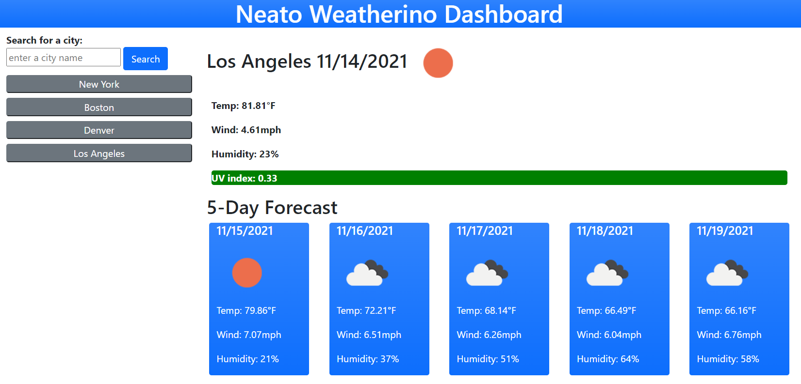

# Neato-Weatherino

## Purpose
Neato Weatherino lets you input a city name and see the current weather including temperature, wind speed, humidity, and UV index (with fancy color coding) as well as the 5-day forecast. It also conveniently creates buttons to easily retrieve previously searched city data.

_Page Sample Screenshot_

### Access

Access the live site [here!](https://lsabin23.github.io/Neato-Weatherino/)

### Future Enhancements Roadmap

* clean up and polish site looks
* add State requirement
